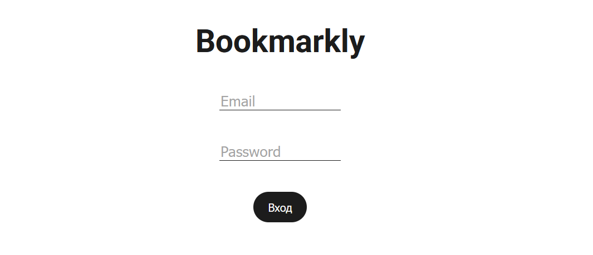
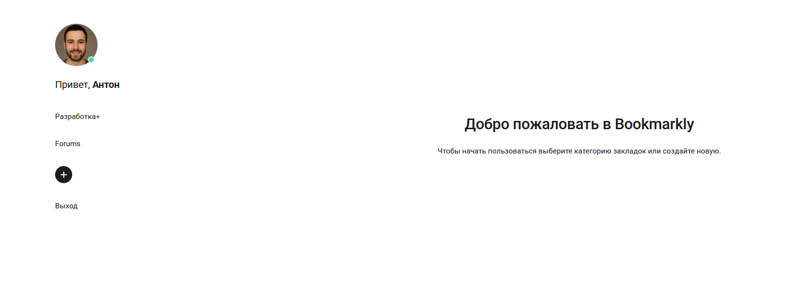
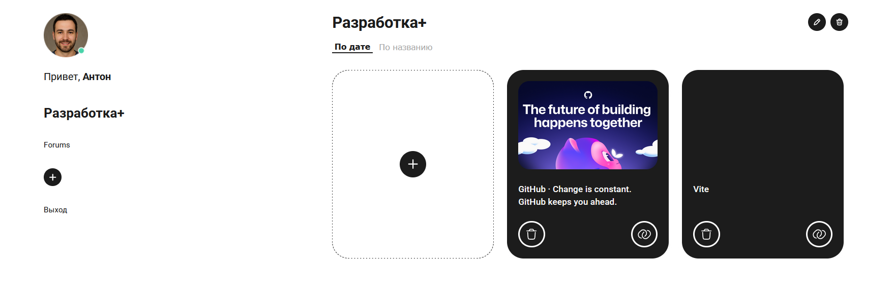

# 🔖 Bookmarkly — менеджер закладок

Умное приложение для хранения и организации закладок по категориям.  
Сделано на **Vue 3 + TypeScript + Pinia**. Данные хранятся локально в браузере.

---

## 📸 Скриншоты





---

## ✨ Возможности

- ✅ **Авторизация** (вход/выход, защита роутов)
- ✅ **Категории** (создание, редактирование, удаление)
- ✅ **Закладки** (добавление, удаление, переход по ссылке)
- ✅ **Сортировка** (по дате и по названию)
- ✅ **Адаптивный интерфейс** (сетка из 3 колонок)
- ✅ **404 страница** для несуществующих маршрутов
- ✅ **Подтверждение удаления** (модальное окно)
- ✅ **Анимации** (плавное появление попапа)

---

## 🔐 Тестовый доступ

Для входа в приложение используйте:

| Email    | Пароль |
| -------- | ------ |
| `a@a.ru` | `1`    |

_Данные существуют только локально, для демонстрации._

---

## 🛠️ Стек технологий

| Технология                  | Назначение          |
| --------------------------- | ------------------- |
| **Vue 3** (Composition API) | Фреймворк           |
| **TypeScript**              | Типизация           |
| **Pinia**                   | Хранилище состояния |
| **Vue Router**              | Навигация           |
| **Vite**                    | Сборка              |
| **localStorage**            | Хранение данных     |

---

## 🚀 Установка и запуск

### 1. Клонировать репозиторий

```bash
git clone https://github.com/rakhzar/bookmarkly.git
cd bookmarkly
```

### 2. Установить зависимости

```bash
npm install
# или bun install
```

### 3. Запустить локальный бэкенд-сервер

В корне проекта находится файл **`bookmark-api-windows-amd64.exe`**.  
Это готовый бэкенд на **Go (Fiber)**. Запустите его:

```bash
./bookmark-api-windows-amd64.exe
```

> 💡 Можно также запустить двойным кликом по файлу.

⚠️ **Важно:** Бэкенд должен быть запущен **до фронтенда**, иначе API не будет отвечать.

### 4. Запустить фронтенд

```bash
npm run dev
# или bun dev
```

После этого приложение будет доступно по адресу:  
🌐 **http://localhost:5173**

### 5. Собрать для продакшна (опционально)

```bash
npm run build
```

Готовая сборка появится в папке **`/dist`**.

---

## 📁 Структура проекта

```
src/
├── components/      # Переиспользуемые компоненты
├── views/           # Страницы (Auth, Category, Index)
├── stores/          # Pinia store
├── interfaces/      # TypeScript-интерфейсы
├── icons/           # SVG-иконки
├── api/             # Работа с API
├── router/          # Настройки роутера
├── App.vue          # Корневой компонент
└── main.ts          # Точка входа
```
